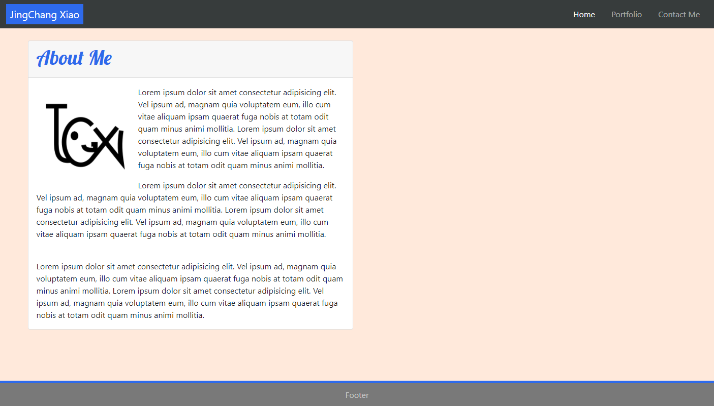
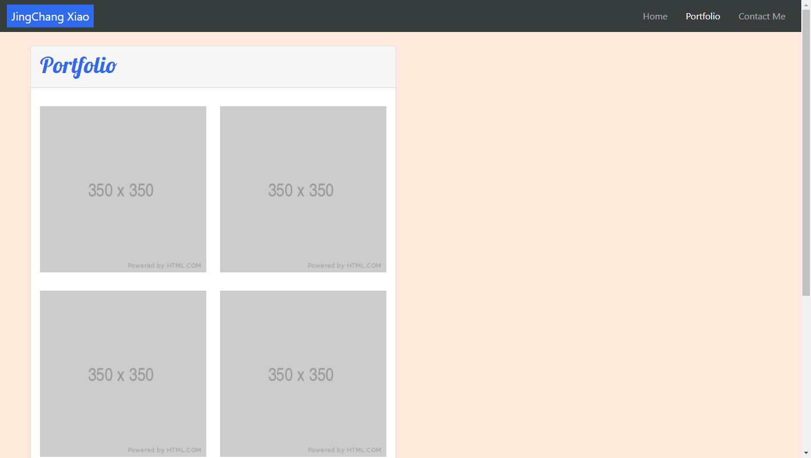
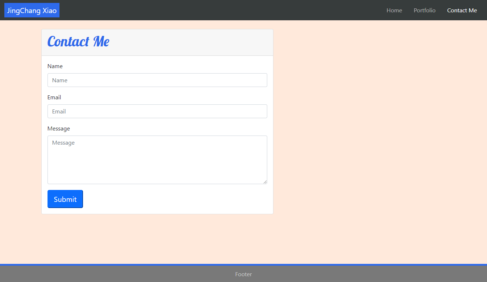

# Unit 02 CSS and Bootstrap Homework: Responsive Portfolio

## Link to live site
https://sinsinkun.github.io/UTOR-Portfolio

Example portfolio made with Bootstrap 5, with considerations for responsive design.
3 pages are included, all using flex design, plus a grid system for the portfolio page.

## External sources
- Bootstrap 5
- Google fonts
- Placeholder image (placeholder.com)

## Screenshots

